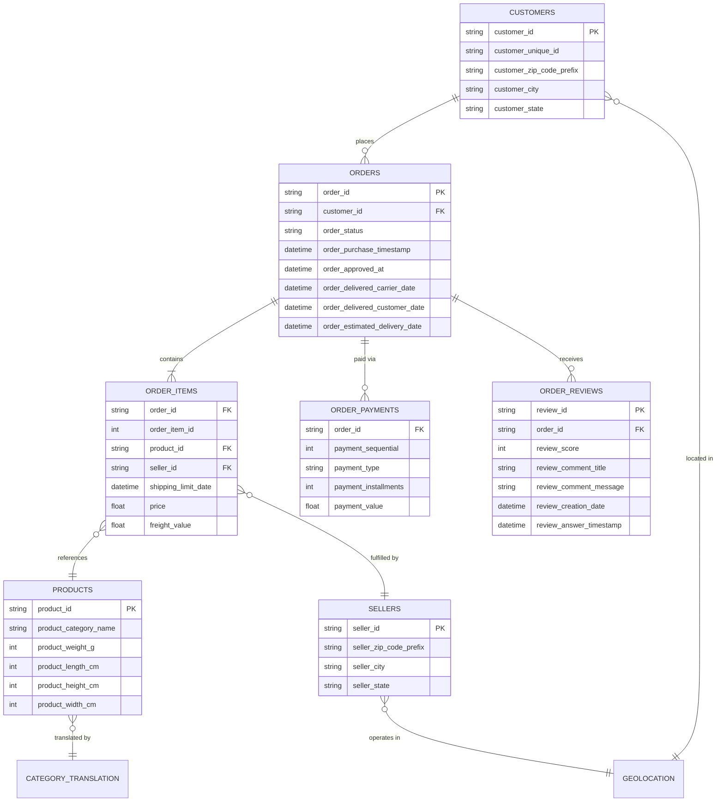

# 🛒 E-Commerce Business Intelligence & Customer Analytics Platform
### *End-to-End E-Commerce Data Analytics, Logistics Optimization & Quasi-Experimental A/B Testing on 100k+ Brazilian Marketplace Orders*

[](https://www.python.org/)
[](https://pandas.pydata.org/)
[](https://numpy.org/)
[](https://scipy.org/)
[](https://seaborn.pydata.org/)
[](https://powerbi.microsoft.com/)
[](https://opensource.org/licenses/MIT)

---

## 📌 Executive Summary

This repository delivers an enterprise-grade customer intelligence and logistics analytics platform analyzing over **100,000 anonymized e-commerce orders** from **Olist**, Brazil's largest department store marketplace (operating across 2016–2018).

The project translates complex relational transaction data across **9 distinct operational tables** into actionable commercial strategy, uncovering drivers of customer satisfaction, delivery bottlenecks, regional revenue disparities, and seller performance. Furthermore, it implements a **rigorous quasi-experimental A/B testing simulation** (using Welch’s Two-Sample $t$-test and Cohen’s $d$ effect size) to empirically evaluate the commercial feasibility of multimillion-dollar logistics capital investments.

```
┌─────────────────┐     ┌───────────────────────┐     ┌──────────────────────┐     ┌─────────────────────┐
│ 9 Raw Datasets  │ ──> │ Data Wrangling & QA   │ ──> │ EDA & Business Intel │ ──> │ A/B Hypothesis Test │
│ 100k+ Records   │     │ Type casting, Nulls   │     │ Outliers, Regional   │     │ Welch's t-test      │
│ Relational Map  │     │ Feature Engineering   │     │ Sales Dynamics, SLAs │     │ Cohen's d: 0.371    │
└─────────────────┘     └───────────────────────┘     └──────────────────────┘     └─────────────────────┘
                                                                                              │
                                                                                              ▼
                                                                                   ┌─────────────────────┐
                                                                                   │ Executive Strategy  │
                                                                                   │ & Business Playbook │
                                                                                   └─────────────────────┘
```

---

## 🏢 Business Context & Core Questions

In high-growth e-commerce marketplaces, logistics operations directly dictate brand equity, repeat purchase rates, and customer review sentiment. The platform's operations executive board posed critical strategic questions:

1. **Customer Spending Behavior:** What is the true Average Order Value (AOV) vs. typical median basket size? How volatile is customer purchasing?
2. **Delivery Speed & Satisfaction:** Does faster shipping provably improve customer satisfaction ratings on a 5-star Likert scale?
3. **Logistics Investment Feasibility:** Before deploying capital into fast-delivery supply chain infrastructure, is the observed rating lift statistically reliable and practically meaningful?
4. **Regional Disparities:** Which Brazilian states generate the bulk of marketplace Gross Merchandise Value (GMV), and where are logistics frictions most severe?
5. **Seller Concentration & Quality:** What fraction of marketplace sellers maintain top-tier service quality (>4.5 rating)?

---

## 📊 Key Business Performance Indicators (KPIs)

| Business Metric | Value | Analytical Interpretation |
| :--- | :---: | :--- |
| **Total Orders Analyzed** | **99,441** | Spanning Q4 2016 to Q3 2018 across all 27 Brazilian federative units |
| **Average Order Value (AOV)** | **R$ 160.58** | Mean transaction basket revenue (including freight) |
| **Median (Typical) Order Value** | **R$ 105.29** | 50th percentile order value; highlights severe positive skewness |
| **Spending Volatility (CV)** | **123.45%** | Standard deviation (R$ 198.23) exceeds mean; highly heterogeneous basket sizes |
| **Average Customer Rating** | **4.08 / 5.00** | Highly polarized; 57.5% 5-star ratings vs. ~11.7% 1-star ratings |
| **Satisfied Customers (≥ 4★)** | **76.06%** | High baseline platform satisfaction |
| **Unsatisfied Customers (< 3★)** | **23.94%** | Primary churn risk group, overwhelmingly driven by delivery breaches |
| **Median Actual Delivery Time** | **10.0 Days** | Baseline threshold utilized for A/B testing split |
| **Top Performer Seller Share** | **28.11%** | Sellers maintaining sustained average review scores > 4.5 stars |

---

## 🗄️ Relational Data Architecture

The platform models 9 relational datasets provided by Olist. The schema preserves entity integrity between customers, orders, payments, reviews, product catalog, sellers, and Brazilian geographic coordinates:



---

## 🔬 Analytical Deep Dive & Notebooks

The repository is modularized into three specialized analytics phases:

```
├── 1_Data_Exploration.ipynb    # Data ingestion, schema validation, cleaning & null auditing
├── 02_EDA_Analysis.ipynb             # Full exploratory data analysis, business questions & visualizations
└── A B Testing Simulation.ipynb       # Quasi-experimental A/B hypothesis test & effect size estimation
```

### 1. Data Cleaning & Integrity Auditing (`1_Data_Exploration.ipynb`)
- **Systematic Null Auditing:** Audited missing values across all 9 relational entities. Handled delivery timestamp anomalies in cancelled/unavailable orders (`order_delivered_customer_date`).
- **Duplicate De-duplication:** Identified and eliminated duplicate geolocation records and review duplicates to preserve observational independence.
- **Type Standardization:** Cast all temporal dimensions (`purchase_timestamp`, `delivered_customer_date`, `estimated_delivery_date`) into standard pandas datetime structures for interval math.

---

### 2. Exploratory Data Analysis & Business Questions (`02_EDA_Analysis.ipynb`)

#### 📈 Customer Spending Volatility & Outlier Modeling
- **Skewness & Dispersion:** The transaction distribution is intensely right-skewed. The Median Order Value sits at **R$ 105.29**, whereas extreme purchases reach upwards of **R$ 13,664.00**.
- **Coefficient of Variation (CV = 123.45%):** Demonstrates that standard deviation exceeds the mean. E-commerce marketing should not treat customers as a single monolithic cohort; high-value accounts require specialized white-glove retention tactics.
- **Freight Outliers:** Heavy items (e.g., furniture, beds in `cama_mesa_banho` weighing > 40kg) introduce steep freight fees that degrade review ratings if unexpected.

#### 🗺️ Regional Economics & Geographic Disparities
- **Market Dominance:** The Southeast region accounts for the majority of GMV. **São Paulo (`SP`)** represents over R$ 3.18M in fulfilled orders, followed by **Rio de Janeiro (`RJ`)** and **Minas Gerais (`MG`)**.
- **Logistics Delivery Gap:** While internal São Paulo deliveries complete in 5–8 business days, deliveries to Northern/Northeastern states (`RR`, `AP`, `AM`, `AC`) frequently take 25–40+ days, with delivery date variances spanning up to 153 days between state corridors.

#### ⭐ Customer Rating Determinants
- **Satisfaction Distribution:** 58,812 orders rated 5 stars; 11,908 orders rated 1 star.
- **Delivery Delay Impact:** Deliveries completed within 5 days average a **4.4★** rating. When shipping duration surpasses 20 days, the average rating collapses to **3.2★**.

---

### 3. Quasi-Experimental A/B Testing Simulation (`A B Testing Simulation.ipynb`)

#### 🧪 Experimental Design
An operations stakeholder asked: *"Does delivering orders faster reliably increase customer ratings enough to justify building automated fulfillment centers?"*

To test this without risky real-world operational changes, we implemented an empirical **quasi-experimental median-split simulation**:
- **Baseline Variable:** `actual_delivery_time` (Days from purchase to customer delivery doorstep).
- **Partition Threshold:** Platform median = **10.0 Days**.
- **Group A (Slower Deliveries):** Delivery time $> 10$ days ($N_A = 46,411$).
- **Group B (Faster Deliveries):** Delivery time $\le 10$ days ($N_B = 49,608$).

```
                      HYPOTHESIS TESTING ARCHITECTURE
                                     │
                 ┌───────────────────┴───────────────────┐
                 ▼                                       ▼
        Group A (Slower >10d)                   Group B (Faster ≤10d)
          Sample: 46,411                          Sample: 49,608
          Mean Rating: 3.91                       Mean Rating: 4.38
                 │                                       │
                 └───────────────────┬───────────────────┘
                                     │
                                     ▼
                          Welch's Two-Sample t-Test
                            t-Statistic: -57.01
                            p-Value: ≈ 0.0 (p < 1e-10)
                                     │
                                     ▼
                            Reject Null Hypothesis
                          Delta: +0.47 Stars (+12.0%)
                          95% CI: [0.453, 0.485]
                                     │
                                     ▼
                            Effect Size Evaluation
                              Cohen's d = 0.371
                             (Modest Effect Size)
```

#### 📐 Formal Hypotheses
$$H_0: \mu_{\text{fast}} \le \mu_{\text{slow}} \quad (\text{Faster delivery is not associated with higher ratings})$$
$$H_1: \mu_{\text{fast}} > \mu_{\text{slow}} \quad (\text{Faster delivery is associated with higher ratings})$$

#### 📊 Statistical Results & Findings
- **Sample Metrics:**
  - Group A (Slower): Mean = **3.912** | Median = 5.0
  - Group B (Faster): Mean = **4.381** | Median = 5.0
  - Mean Rating Delta: **+0.469 stars** ($p \approx 0.0$)
- **Two-Sample Welch's $t$-Test:**
  - $t$-statistic = **57.01**
  - Degrees of Freedom $\approx 96,000+$
  - $p$-value = **$0.0000$** ($p < 10^{-16}$)
  - **Decision:** **Reject $H_0$** at $\alpha = 0.01$. The rating superiority of faster delivery is statistically incontrovertible.
- **Confidence Intervals:**
  - 95% Confidence Interval for mean difference: **$[0.4532, \, 0.4855]$ stars**.
- **Standardized Effect Size (Cohen’s $d$):**
  $$d = \frac{\bar{x}_B - \bar{x}_A}{s_{\text{pooled}}} = \frac{0.4693}{1.264} \approx \mathbf{0.371}$$
  - Standard Cohen's benchmarks: $0.2 \le d < 0.5$ designates a **small-to-moderate practical effect size**.

#### 💡 Executive Decision-Making Takeaway
While the $+0.47$-star increase is statistically guaranteed ($p < 0.0001$), Cohen's $d = 0.371$ shows that delivery speed alone explains only a modest fraction of rating variance. Product quality, item packaging, accurate descriptions, and customer support resolve the remaining ~63% of rating variations. 
- **Recommendation:** Rather than spending billions on same-day delivery networks, **the primary operational priority must be SLA consistency (eliminating deliveries exceeding estimated arrival dates)**, which generates the steepest drops in satisfaction.

---

## 🎯 Strategic Business Recommendations

```
┌────────────────────────────────────────────────────────────────────────────────────────┐
│                               OPERATIONAL PLAYBOOK                                     │
├──────────────────────────────┬─────────────────────────────────────────────────────────┤
│ 1. Zero-Late-Delivery Policy │ Late deliveries destroy CSAT (-1.8★ avg drop). Enforce  │
│                              │ dynamic buffer estimates rather than tight unrealistic  │
│                              │ arrival dates.                                          │
├──────────────────────────────┼─────────────────────────────────────────────────────────┤
│ 2. Regional Fulfillment Hubs │ 70%+ of orders originate in SP/RJ/MG. Establishing      │
│                              │ forward-deployed fulfillment centers in Rio & Belo      │
│                              │ Horizonte cuts transit time below the 10-day threshold. │
├──────────────────────────────┼─────────────────────────────────────────────────────────┤
│ 3. Seller Rating Tiering     │ 28.11% of sellers achieve >4.5★ ratings. Provide buy-   │
│                              │ box priority and lower commission rates to top-tier     │
│                              │ sellers; introduce probation for sellers below 3.5★.    │
├──────────────────────────────┼─────────────────────────────────────────────────────────┤
│ 4. Freight Subsidies for     │ Northern regions suffer high freight rates & friction.  │
│    Remote States             │ Introduce regional shipping subsidies on high-margin    │
│                              │ categories to unlock underserved customer markets.      │
└──────────────────────────────┴─────────────────────────────────────────────────────────┘
```

---

## 🛠️ Technology Stack & Libraries

- **Language:** Python 3.9+
- **Data Manipulation & Analysis:** `pandas`, `numpy`
- **Statistical Inference & Hypothesis Testing:** `scipy.stats` (Welch's $t$-test, Cohen's $d$, Confidence Intervals)
- **Data Visualization & Exploratory plots:** `seaborn`, `matplotlib`
- **Business Intelligence & Dashboards:** Power BI (DAX, Star Schema Modeling), SQL

---

## 🚀 Getting Started & Execution Guide

### 1. Clone the Repository
```bash
git clone https://github.com/Vinaychauhan06/OLIST-E-COMMERCE-ANALYTICS-Dashboard-Python-Power-BI-.git
cd OLIST-E-COMMERCE-ANALYTICS-Dashboard-Python-Power-BI-
```

### 2. Environment Setup
Create and activate an isolated Python virtual environment:
```bash
python3 -m venv venv
source venv/bin/activate  # On Windows: venv\Scripts\activate
pip install -r requirements.txt
```

### 3. Launch Jupyter Notebooks
```bash
jupyter lab
# or: jupyter notebook
```
Navigate to:
- `1_Data_Exploration.ipynb` to review data hygiene and cleaning steps.
- `02_EDA_Analysis.ipynb` to explore detailed market trends, visualizations, and business intelligence.
- `A B Testing Simulation.ipynb` to verify the statistical hypotheses, $t$-tests, and effect sizes.

---

## 📈 Planned Future Enhancements

- [ ] **Interactive Power BI Dashboard:** Multi-tab executive report featuring real-time slicers for State, Category, and Delivery SLA tracking.
- [ ] **Predictive Machine Learning Pipeline:** XGBoost model forecasting delivery delays at checkout time.
- [ ] **Customer Lifetime Value (CLV) & Churn Modeling:** RFM segmentation (Recency, Frequency, Monetary) to detect churn risk cohorts.

---

## 👤 Author & Contributor

**Vinay Chauhan**  
*Data Analyst & Business Intelligence Specialist*  
- **Email:** [Vc203132@gmail.com](mailto:Vc203132@gmail.com)
- **GitHub:** [@Vinaychauhan06](https://github.com/Vinaychauhan06)
- **LinkedIn:** [Vinay Chauhan](https://www.linkedin.com/)

---

## 📜 License
This project is open-source under the [MIT License](LICENSE).